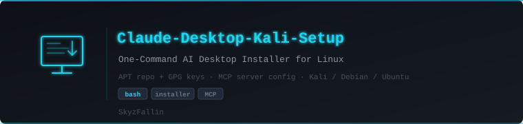

<p align="center">
  
</p>

<p align="center">
  
  
  
  
</p>

# claude-desktop-kali-setup

One-command installer for Claude Desktop + MCP servers on Kali/Debian/Ubuntu.

**Author:** [SkyzFallin](https://github.com/SkyzFallin)

## What It Does

The install script:

- Generates **our own** GPG signing keypair (no third-party key pulled from GitHub)
- Builds the `claude-desktop` `.deb` **from source** ([aaddrick/claude-desktop-debian](https://github.com/aaddrick/claude-desktop-debian))
- Signs the built package with our key and verifies the signature before installing
- Installs `claude-desktop` and `mcp-kali-server`
- Configures MCP servers (filesystem + Kali MCP) in `~/.config/Claude/claude_desktop_config.json`

## Package Signing

Rather than trusting a prebuilt package from an external APT repo, this setup is
self-contained:

- `scripts/generate-signing-key.sh` creates a fresh ed25519 signing keypair
  (stored in `/etc/claude-desktop/signing-gnupg`) and exports the public key to
  `claude-desktop-signing.pub.asc`.
- The installer builds the `.deb` locally, signs it with that key, and refuses
  to install unless the signature verifies.

You can (re)generate the key on its own:

```bash
CLAUDE_GNUPGHOME=~/.claude-desktop-signing ./scripts/generate-signing-key.sh
```

## Quick Start

```bash
git clone https://github.com/SkyzFallin/claude-desktop-kali-setup.git
cd claude-desktop-kali-setup
./install-claude-desktop.sh
```

Run it as a normal user, **not** with `sudo` — the upstream Claude Desktop
build script refuses to run as root. The installer calls `sudo` itself for the
steps that need it, so you may be prompted for your password.

## After Installation

The installer adds a **Claude Desktop (Kali MCP)** shortcut to your Desktop and
app menu. Launching it starts the Kali API server (only if it isn't already
running) and then opens Claude Desktop — so a single click brings up the whole
stack.

To do it manually instead:

1. Start the Kali API server: `kali-server-mcp`
2. Launch Claude Desktop: `claude-desktop-unofficial`
   (upstream names the binary `claude-desktop-unofficial` so it can coexist
   with Anthropic's official `claude-desktop` package)

The launcher script lives at `~/.local/bin/claude-kali-launch`; the API server's
output is logged to `/tmp/kali-server-mcp.log`.

### Using the MCP tools

The `kali-mcp-server` and `filesystem` tools appear in a **regular local chat**
inside the desktop app — look for the tools/connector control near the message
box. Try: *"Use the Kali MCP tools to run `nmap -sn 127.0.0.1`."*

Do **not** test this from a Cowork **cloud** task. Cloud tasks run in Anthropic's
sandbox and cannot reach an MCP server running on your machine — a cloud session
will report the tools as unavailable even when everything is configured
correctly. Use a local chat (or a task set to run on your computer) instead.

### Verifying the Kali server directly

If a scan doesn't work, check the API server itself rather than trusting the
model's self-description of its tools:

```bash
curl -s http://127.0.0.1:5000/health | python3 -m json.tool
curl -s -X POST http://127.0.0.1:5000/api/tools/nmap \
  -H 'Content-Type: application/json' \
  -d '{"target":"127.0.0.1","scan_type":"-sn","additional_args":""}' | python3 -m json.tool
```

`all_essential_tools_available: true` and a scan with `return_code: 0` mean the
server is healthy end to end.

## Sources

- [claude-desktop-debian](https://github.com/aaddrick/claude-desktop-debian) — Debian packaging for Claude Desktop
- [mcp-kali-server](https://www.kali.org/tools/mcp-kali-server/) — Kali MCP server for Claude

## License

MIT
